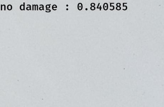
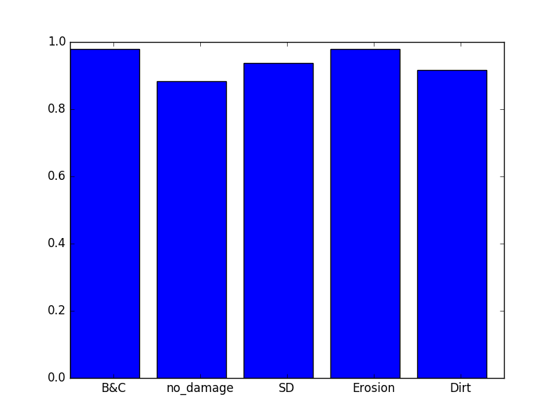

# TILES CLASSIFICATION using INCEPTION V3

## Requirements
Python 3.6 

## Installation
1. Clone this repository

```
$ git clone http://141.252.12.43/adions025/damagedetection.git
```

## Preprocessing of dataset images
usage:

In the dataset folder, we find the files to prepare our set images. 

- **damageTiles.py:**  Tiles the image and for each tile, it will calculate if there is an annotation
inside, it makes use of the functions of "min of the maxes"and "max of the min",
from here we detect, if we have annotation in tile, and that percentage of annotation
in the tile, and create different folders for each type of these annotations.
You can fin more information here  [TILE IMAGE](https://github.com/adions025/tile_for_classification/tree/master/dataset). README file just for tile process.

- **damageStats.py:**  This file save histogram the distribution after tiling images.

- **damageAugm.py:** This file allows us to augment the images in our unbalanced dataset, 
it allows us to create a given class size the amount we need to balance, you can also use this class in real time while
 training the model. 

- **damageSplitDataset.py:** Use this file if you want split your dataset, just use value between 0.0 and 1.0 
for uniform distribution.


## Training, predictions and results 
usage:
The main files are in /src:

- **train.py:** To train the model using the inception architecture, you will have to put your different classes in 
different folders, for images or tiles with more than one annotation you will have to use a multi-damage folder. 
Make sure you put the right path where you have your subfolders.

- **prediction.py:** This file allows us to predict our testing folder, but it also saves these results writing in the 
tile the precision value and the class.
It also saves a .csv file of results for each class, thus we can get more metrics and get conclusions from our model.

- **results.py:** What it does is read the csv file in each class we have obtained, to calculate the mAP.

## Running the Results
- **prediction.py:** after running this file you can get your prediction.



- **results.py:** calculate the mAP for each class.



## Versioning
You can use the script I made to get the different versions [**versionsLinux.sh**], make sure this file has the execution permissions. With this file you will get the different versions of the project. 
You can use this file in unix systems, but if you are in Windows make sure you change the extension to [**.bat**].

## Authors

* **Adonis González Godoy** - *tiles for classifications with inception v3 - transfer learning* - [NHL Stenden University](https://github.com/adions025)


